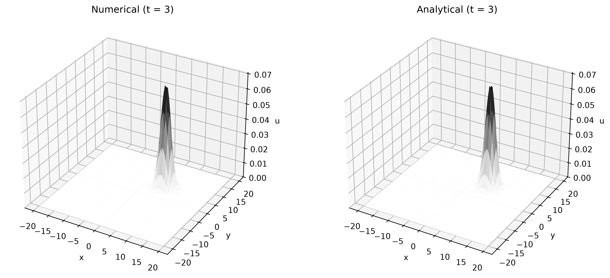

# Numerical PDE Solvers

A collection of numerical solvers for linear advection, diffusion, and advection-diffusion equations, implemented in Python using finite-difference and finite-volume methods.

The project focuses on numerical stability, conservation, analytical validation, and grid-convergence analysis.

---

## Overview

| Problem                | Numerical method          | Time integration |
| ---------------------- | ------------------------- | ---------------- |
| 1D Linear Advection    | Central finite difference | RK4              |
| 1D Linear Advection    | Rusanov finite volume     | TVD-RK3          |
| 2D Linear Advection    | Central finite difference | RK4              |
| 2D Linear Advection    | Rusanov finite volume     | TVD-RK3          |
| 1D Advection-Diffusion | Central finite difference | RK4              |
| 2D Diffusion           | Central finite difference | RK4              |

Periodic boundary conditions are used throughout the simulations.

---

## Governing Equations

### 1D Linear Advection

The equation is

$$
\frac{\partial u}{\partial t}
+
c\frac{\partial u}{\partial x}
=0.
$$

For an initial condition \(u_0(x)\), the analytical solution is

$$
u(x,t)=u_0(x-ct).
$$

---

### 2D Linear Advection

The equation is

$$
\frac{\partial u}{\partial t}
+
c_x\frac{\partial u}{\partial x}
+
c_y\frac{\partial u}{\partial y}
=0.
$$

For the Gaussian initial condition used in the simulations,

$$
u(x,y,0)
=
\frac{1}{2\pi\sigma^2}
\exp\left[
-\frac{x^2+y^2}{2\sigma^2}
\right],
$$

the analytical solution is the translated Gaussian

$$
u(x,y,t)
=
\frac{1}{2\pi\sigma^2}
\exp\left[
-\frac{(x-c_xt)^2+(y-c_yt)^2}
{2\sigma^2}
\right].
$$

---

### 1D Advection-Diffusion

The equation is

$$
\frac{\partial u}{\partial t}
+
c\frac{\partial u}{\partial x}
=
D\frac{\partial^2u}{\partial x^2}.
$$

For the point-source initial condition

$$
u(x,0)=\delta(x),
$$

the analytical solution is

$$
u(x,t)
=
\frac{1}{\sqrt{4\pi Dt}}
\exp\left[
-\frac{(x-ct)^2}{4Dt}
\right].
$$

This represents simultaneous translation with velocity \(c\) and diffusion with coefficient \(D\).

---

### 2D Diffusion

The equation is

$$
\frac{\partial u}{\partial t}
=
D_x\frac{\partial^2u}{\partial x^2}
+
D_y\frac{\partial^2u}{\partial y^2}.
$$

For a point-source initial condition,

$$
u(x,y,0)=\delta(x)\delta(y),
$$

the analytical solution is

$$
u(x,y,t)
=
\frac{1}{4\pi t\sqrt{D_xD_y}}
\exp\left[
-\frac{x^2}{4D_xt}
\right]
\exp\left[
-\frac{y^2}{4D_yt}
\right].
$$

---

## Numerical Methods

### Central Finite Difference

Spatial derivatives are approximated using centered finite differences. For example,

$$
\frac{\partial u}{\partial x}
\approx
\frac{u_{i+1}-u_{i-1}}
{2\Delta x}.
$$

The resulting semi-discrete equations are integrated using classical fourth-order Runge-Kutta (RK4).

### Rusanov Finite-Volume Scheme

The advection solvers also use the Rusanov numerical flux,

$$
F_{i+\frac12}
=
\frac{1}{2}
\left[
F(u_L)+F(u_R)
\right]
-
\frac{1}{2}
a_{\max}
(u_R-u_L),
$$

with CFL-based timestep control.

Time integration is performed using the third-order TVD Runge-Kutta scheme (TVD-RK3).

---

## Validation

Numerical solutions are compared against analytical solutions at

$$
t=0.1,\quad 0.3,\quad 1,\quad 3.
$$

The simulations track quantities including:

* Numerical mass
* Analytical mass
* Maximum absolute error
* \(L_2\) error
* Relative \(L_2\) error

Representative numerical and analytical solutions are shown below.

---

## Results

### 1D Central Advection

Numerical solution compared with the analytical translated Gaussian at \(t=3\).


### 1D Rusanov Advection

The Rusanov scheme produces a more diffusive numerical profile compared with the analytical solution.


### 2D Central Advection

Comparison of the numerical and analytical Gaussian profiles after advection.



### 2D Rusanov Advection

Comparison of the numerical and analytical solutions using the Rusanov finite-volume scheme.


### 1D Advection-Diffusion

The Gaussian simultaneously translates and spreads due to advection and diffusion.


### 2D Diffusion

Comparison of the numerical and analytical diffusion profiles.


---

## Grid Convergence

Two independent grid-convergence studies were performed for the 1D advection problem.

### Central Difference

The observed convergence order approaches 2:

| Grid refinement | Observed order |
| --------------- | -------------: |
| 250 → 500       |         1.9634 |
| 500 → 1000      |         1.9955 |
| 1000 → 2000     |         1.9992 |
| 2000 → 4000     |         1.9998 |


The results demonstrate second-order convergence of the centered spatial discretization.

### Rusanov Flux

The observed convergence order approaches 1 with grid refinement:

| Grid refinement | Observed order |
| --------------- | -------------: |
| 250 → 500       |         0.5792 |
| 500 → 1000      |         0.7194 |
| 1000 → 2000     |         0.8305 |
| 2000 → 4000     |         0.9051 |
| 4000 → 8000     |         0.9495 |


The finest-grid refinement gives an observed order of 0.9495, approaching the expected first-order behavior of the Rusanov discretization.

---

## Repository Structure

```text
Numerical-PDE-Solvers/
│
├── README.md
├── requirements.txt
│
├── src/
│   ├── advection_1d_central.py
│   ├── advection_1d_rusanov.py
│   ├── advection_2d_central.py
│   ├── advection_2d_rusanov.py
│   ├── advection_diffusion_1d.py
│   └── diffusion_2d.py
│
├── benchmarks/
│   ├── convergence_1d_central.py
│   └── convergence_1d_rusanov.py
│
└── figures/
    ├── advection_1d_central_t*.png
    ├── advection_1d_rusanov_t*.png
    ├── advection_2d_central_t*.png
    ├── advection_2d_rusanov_t*.png
    ├── advection_diffusion_1d_t*.png
    ├── diffusion_2d_t*.png
    ├── convergence_1d_central.png
    └── convergence_1d_rusanov.png
```

---

## Running the Solvers

Install the required packages:

```bash
pip install -r requirements.txt
```

Run any solver from the project root:

```bash
python src/advection_1d_central.py
```

For example:

```bash
python src/advection_1d_rusanov.py
python src/advection_2d_central.py
python src/advection_2d_rusanov.py
python src/advection_diffusion_1d.py
python src/diffusion_2d.py
```

The generated figures are automatically saved to:

```text
figures/
```

---

## Running the Convergence Tests

The convergence studies are kept separate from the solver implementations.

```bash
python benchmarks/convergence_1d_central.py
python benchmarks/convergence_1d_rusanov.py
```

The corresponding convergence plots are saved in `figures/`.

---

## Key Results

* Implemented finite-difference and finite-volume solvers for 1D and 2D transport and diffusion problems.
* Used RK4 and TVD-RK3 time integration.
* Implemented periodic boundary conditions and CFL-based timestep control.
* Validated numerical solutions against analytical Gaussian solutions.
* Quantified numerical error using maximum, \(L_2\), and relative \(L_2\) error measures.
* Demonstrated approximately second-order convergence for the centered 1D advection scheme.
* Demonstrated convergence toward first-order behavior for the Rusanov advection scheme.
* Generated numerical-versus-analytical visualizations for all implemented solvers.
