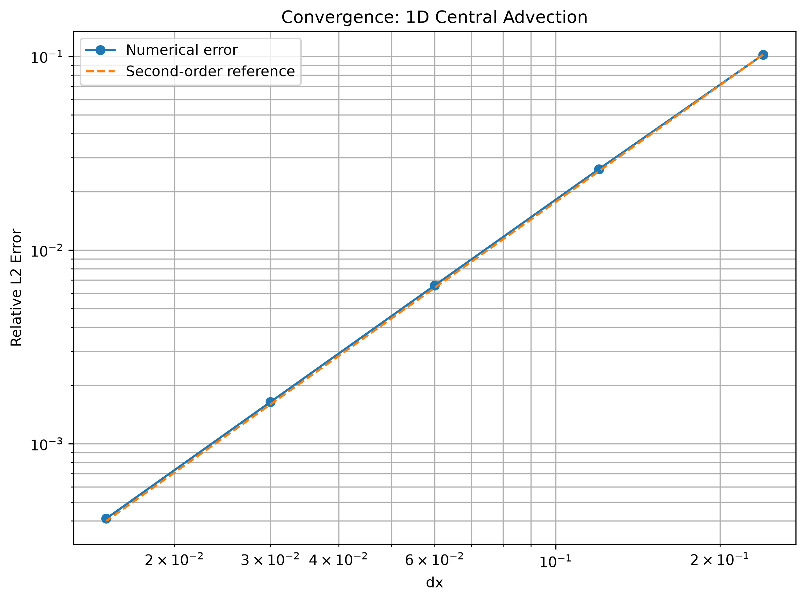
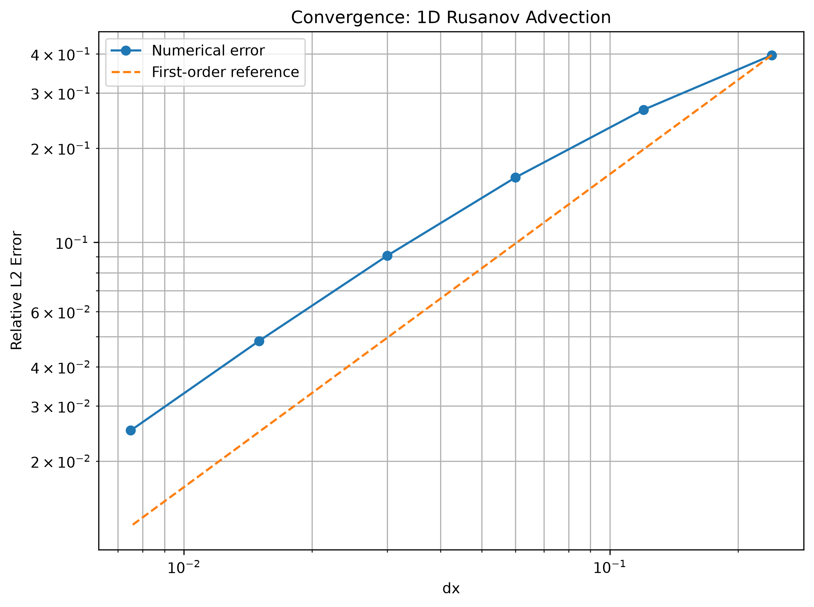
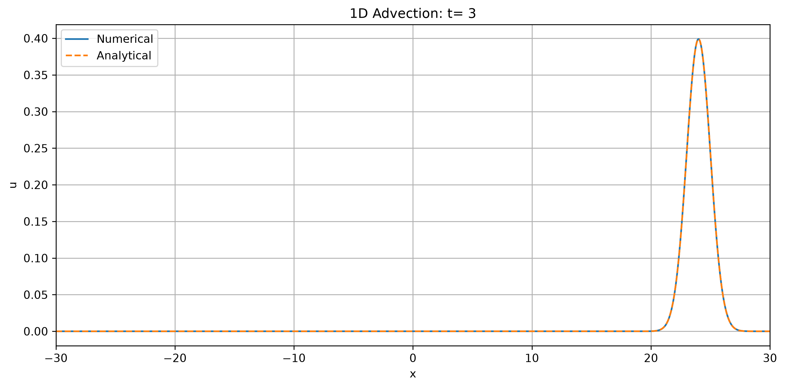
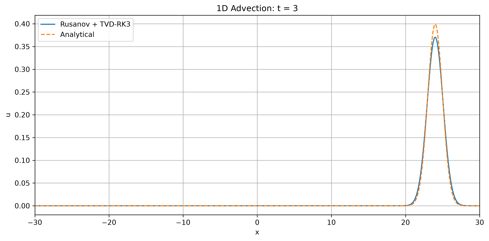
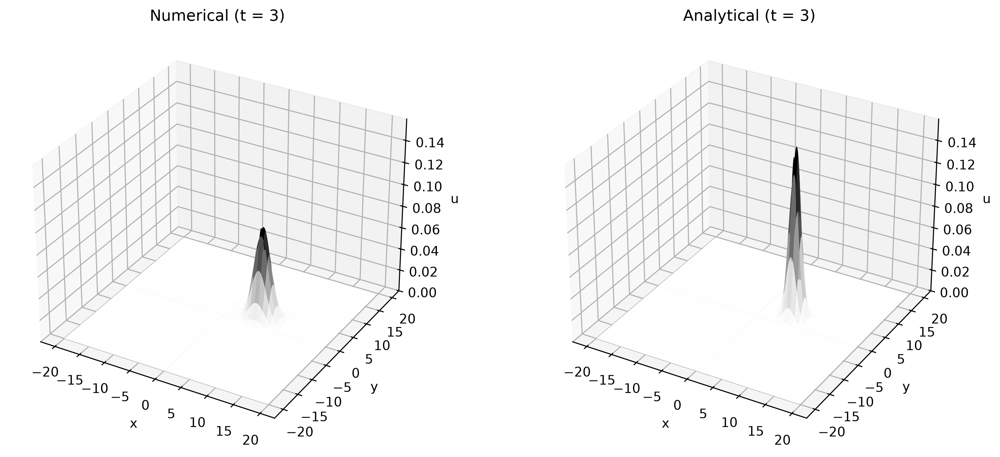
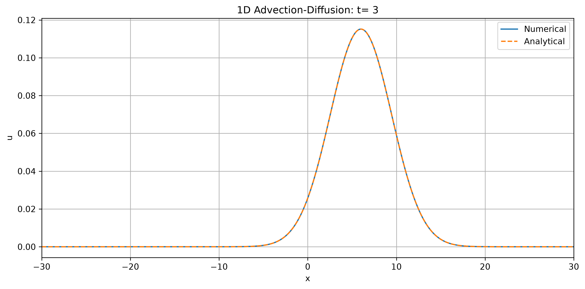
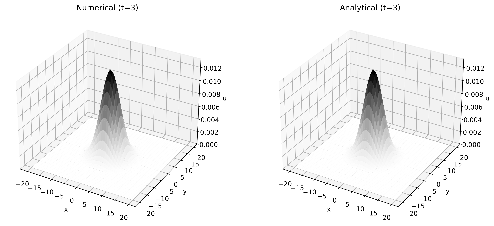

# Numerical PDE Solvers

A collection of numerical solvers for 1D and 2D advection, diffusion, and advection-diffusion equations, implemented in Python using NumPy and Matplotlib.

The project explores finite-difference and finite-volume methods, explicit time integration, CFL-based timestep control, and comparison with analytical solutions.

## Solvers

| Problem                | Method             | Time Integration |
| ---------------------- | ------------------ | ---------------- |
| 1D Advection           | Central Difference | RK4              |
| 1D Advection           | Rusanov Flux       | TVD-RK3          |
| 2D Advection           | Central Difference | RK4              |
| 2D Advection           | Rusanov Flux       | TVD-RK3          |
| 1D Advection-Diffusion | Central Difference | RK4              |
| 2D Diffusion           | Central Difference | RK4              |

Periodic boundary conditions are used throughout.

## Validation

The numerical solutions are compared with analytical solutions using:

* Mass conservation
* Maximum value
* Relative \(L_2\) error
* Visual comparison

A grid-convergence study was also performed for the two 1D advection solvers.

### Central Difference

The observed convergence order approaches **2nd order**:

| Refinement  |  Order |
| ----------- | -----: |
| 250 → 500   | 1.9634 |
| 500 → 1000  | 1.9955 |
| 1000 → 2000 | 1.9992 |
| 2000 → 4000 | 1.9998 |



### Rusanov Flux

The observed order approaches **1st order** on finer grids:

| Refinement  |  Order |
| ----------- | -----: |
| 250 → 500   | 0.5792 |
| 500 → 1000  | 0.7194 |
| 1000 → 2000 | 0.8305 |
| 2000 → 4000 | 0.9051 |
| 4000 → 8000 | 0.9495 |



## Sample Results

### 1D Advection



### 1D Rusanov Advection



### 2D Advection



### 1D Advection-Diffusion



### 2D Diffusion



## Structure

```text
Numerical-PDE-Solvers/
├── README.md
├── requirements.txt
├── .gitignore
├── src/
│   ├── advection_1d_central.py
│   ├── advection_1d_rusanov.py
│   ├── advection_2d_central.py
│   ├── advection_2d_rusanov.py
│   ├── advection_diffusion_1d.py
│   └── diffusion_2d.py
├── benchmarks/
│   ├── convergence_1d_central.py
│   └── convergence_1d_rusanov.py
└── figures/
```

## Running

```bash
pip install -r requirements.txt
```

Run any solver with:

```bash
python src/advection_1d_central.py
```

The figures are automatically saved in `figures/`.
